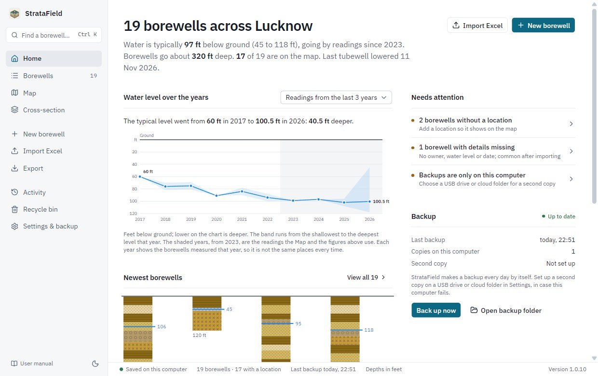
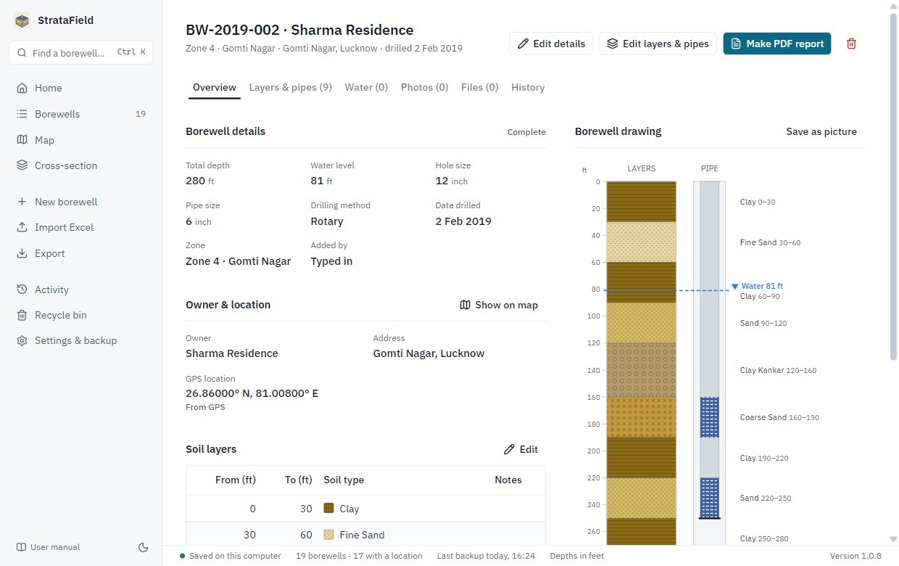
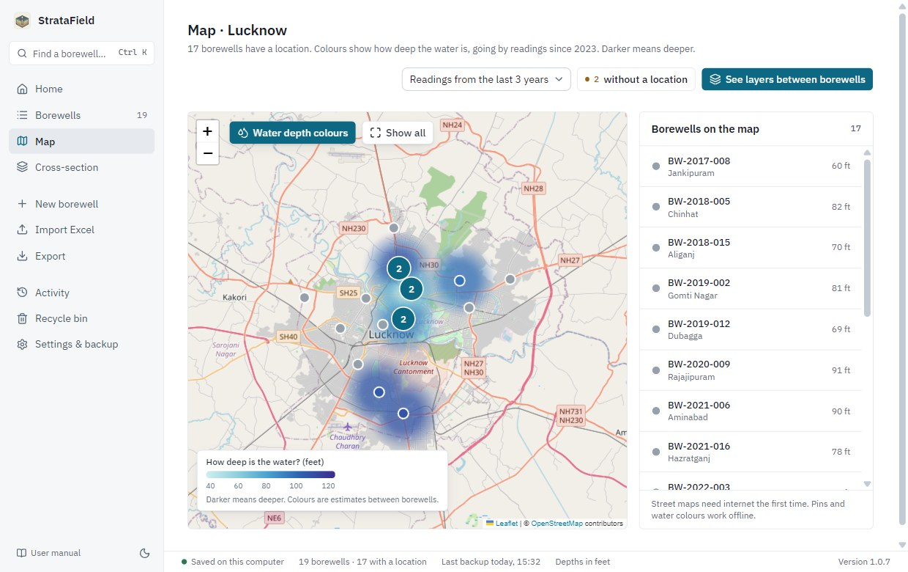
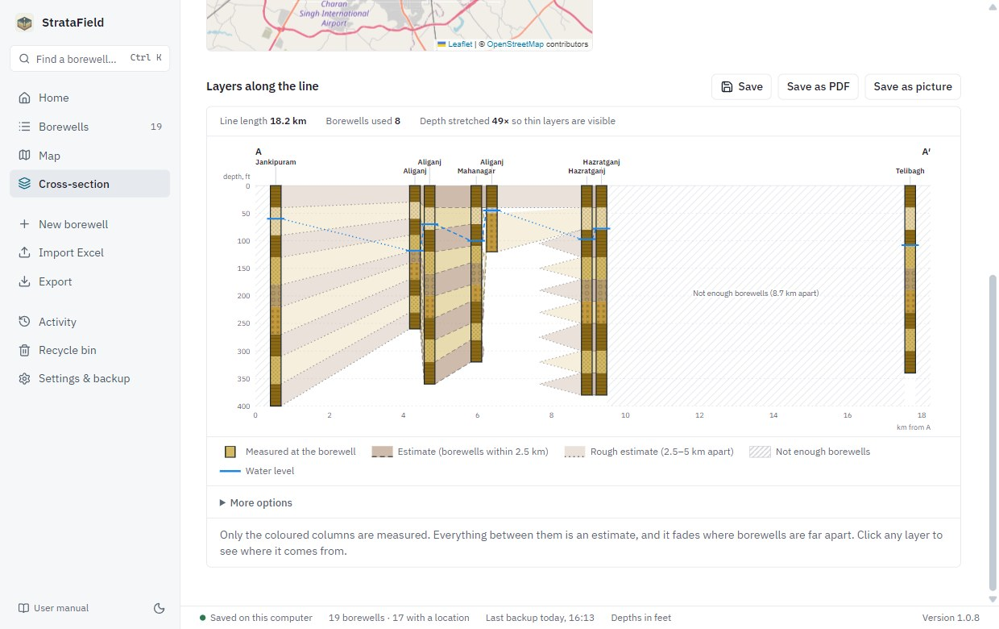
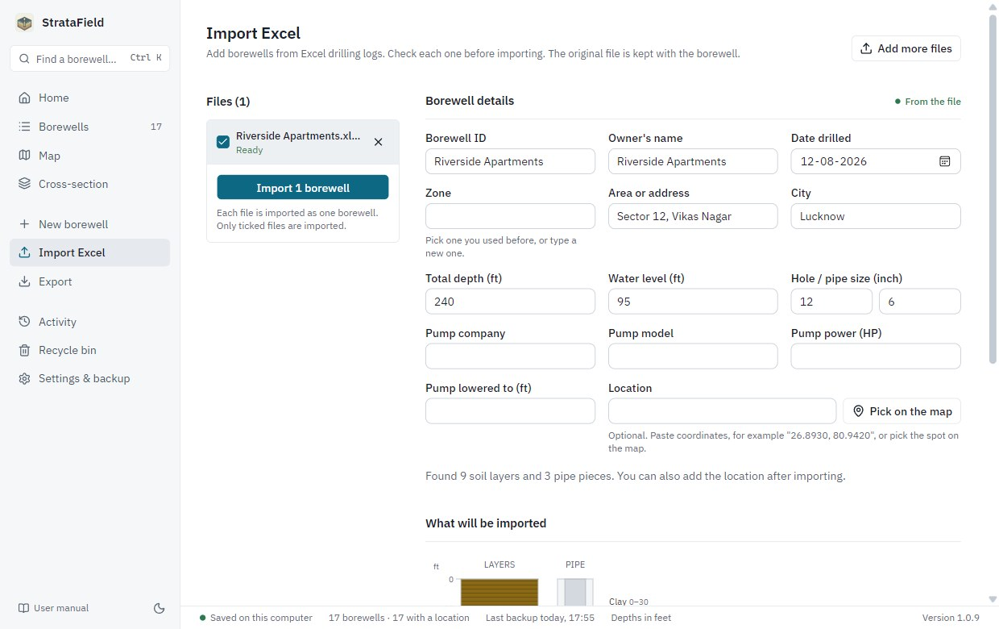
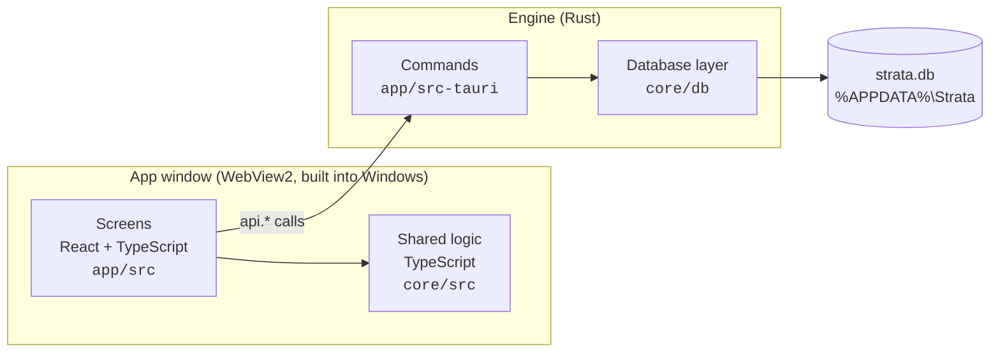

<p align="center">
  
</p>

<h1 align="center">StrataField</h1>

<p align="center">
  Borewell records, soil layers and groundwater levels for Windows.<br>
  Offline, on your own computer, in plain language.
</p>

<p align="center">
  <a href="https://github.com/Mehulsri07/StrataField/releases/latest"></a>
  <a href="https://github.com/Mehulsri07/StrataField/actions/workflows/ci.yml"></a>
  
</p>

<p align="center">
  <a href="https://github.com/Mehulsri07/StrataField/releases/latest"><b>Download</b></a> ·
  <a href="INSTALL.md">Install guide</a> ·
  <a href="app/src-tauri/resources/StrataField%20User%20Manual.pdf">User manual (PDF)</a> ·
  <a href="CHANGELOG.md">What's new</a> ·
  <a href="SECURITY.md">Security</a>
</p>



## Overview

StrataField is a desktop application for drilling contractors and hydrogeologists who keep borewell
records. For each borewell it stores the owner and location, the soil layers found at each depth,
the pipe assembly, water levels over time, and the photos and files from the site. It then puts the
records to work: a map of the city coloured by depth to water, cross-sections of the ground between
borewells, and the change in water level over the years.

It is written for people in the field rather than for developers. Screens are step by step, wording
is plain, and everything except address look-up works without internet. All data stays on the
computer it is installed on.

**Current version: 1.0.12.** Pilot city: Lucknow.

## Features

| | |
|---|---|
| **Records** | Owner, zone, location, drilling details, soil layers, plain pipe and screens, water readings over time, photos and files. Every change is kept in the record's history. |
| **Excel import** | Reads field drilling logs as they are actually written: layers in fixed steps or drawn to scale, feet or metres, with the site details beside them. Files in other layouts can be imported by choosing their columns. |
| **Map** | Every borewell on a map of Lucknow, coloured by depth to water, using only recent readings (1, 3 or 5 years, or all). Works without internet once the city map is downloaded. |
| **Cross-sections** | Draw a line on the map, with bends, to see the layers beneath it. Measured columns and estimates between them are drawn differently, and never confused. |
| **Trends** | The typical water level for each year, and a summary by zone. |
| **Reports** | A PDF page per borewell with its drawing; cross-sections as PDF or picture; everything as one Excel workbook. |
| **Safety** | A backup every day, a second copy to a USB drive or cloud folder, a Recycle bin, and restore from any backup. |
| **Updates** | Signed automatic updates from GitHub Releases. |

<table>
  <tr>
    <td width="50%"><br><sub>A borewell: details, layers, pipe and water level.</sub></td>
    <td width="50%"><br><sub>The map, coloured by depth to water.</sub></td>
  </tr>
  <tr>
    <td><br><sub>A cross-section: measured columns, estimates between.</sub></td>
    <td><br><sub>Checking an Excel drilling log before importing it.</sub></td>
  </tr>
</table>

<sub>Screenshots show made-up borewells. They are taken from the real app by `scripts/build-manual.mjs`, which also builds the user manual.</sub>

## Installing

Download the installer from the [latest release](https://github.com/Mehulsri07/StrataField/releases/latest)
and run it. It is about 7 MB, needs no administrator password, and installs for the current user.
[INSTALL.md](INSTALL.md) has the details, including the "Windows protected your PC" notice shown for
software that is not yet code-signed. Installed copies update themselves.

The **user manual**, a PDF with a picture of every screen, is installed with the app (Start menu,
and **User manual** at the bottom of the app's menu). It can also be read
[here](app/src-tauri/resources/StrataField%20User%20Manual.pdf).

---

## Contents

- [Architecture](#architecture)
- [Repository layout](#repository-layout)
- [Data storage](#data-storage)
- [Security](#security)
- [Design principles](#design-principles)
- [Development](#development)
- [Testing, CI and releases](#testing-ci-and-releases)
- [Project history](#project-history)
- [Roadmap](#roadmap)
- [Data sources](#data-sources)

---

## Architecture

StrataField is a [Tauri 2](https://tauri.app) application. It has two halves that talk to each other:



| Part | Language | Responsibility |
|---|---|---|
| **Screens** (`app/src`) | React, TypeScript, Tailwind, shadcn/ui | Everything the user sees and clicks. |
| **Shared logic** (`core/src`) | TypeScript | Validation, the soil-type list, reading Excel logs, water-depth estimates and colours, cross-section geometry, Excel export. No UI code; fully unit-tested. |
| **Commands** (`app/src-tauri`) | Rust | The fixed set of actions the screens may request: save a borewell, add a photo, make a backup. |
| **Database layer** (`core/db`) | Rust | SQLite schema and migrations, reading and writing records, backups, and the one-time import of the older app's data. |

The Rust side is deliberately thin and only does what needs the computer itself: the database,
files and backups. Most logic lives in TypeScript in `core/`, where it is quick to change and test.
Because Tauri uses the WebView2 runtime that Windows already has, the installer is about 7 MB
(manual included), against 134 MB for the Electron version it replaced.

### What happens when a borewell is saved

1. The **New borewell** screen (`app/src/pages/BorewellForm.tsx`) checks the entries with
   `checkBorewell` and `checkLayers` from `core/src/validation.ts` and reports problems in plain words.
2. It calls `api.borewells.create(...)` in `app/src/lib/api.ts`.
3. That invokes the Rust command `borewell_create` in `app/src-tauri/src/commands.rs`.
4. The command calls `borewells::create` in `core/db/src/repo/borewells.rs` inside a database
   transaction, which also writes a line to the record's history.
5. The screen reloads its data (`useLoad` in `app/src/lib/data.tsx`). Any other Strata app open on
   the same data notices the change within a few seconds and reloads too.

### Browser preview

`npm run dev -w app` opens the screens in an ordinary browser with sample Lucknow data; no Rust is
needed. It is used for design work. The switch is `isPreview` in `app/src/lib/api.ts`, and the
sample answers are in `app/src/lib/preview.ts` and `sample.ts`. Actions that need the real app
(saving files, backups) say so instead of running.

---

## Repository layout

```text
StrataField/
├── app/                        The StrataField desktop app
│   ├── src/                    Screens (React)
│   │   ├── pages/              One file per screen: Home, Borewells, BorewellDetail, BorewellForm,
│   │   │                       EditLayers, MapPage, SectionPage, ImportPage, ExportPage,
│   │   │                       Activity, RecycleBin, Settings
│   │   ├── components/
│   │   │   ├── app/            App frame: menu, page layout, status labels, confirm dialog
│   │   │   ├── geology/        Borewell drawing, layer patterns, layer popup, layer editor,
│   │   │   │                   cross-section drawing
│   │   │   ├── map/            Base map, borewell pins, water-depth colours, map picker
│   │   │   └── ui/             shadcn/ui building blocks (buttons, dialogs, selects)
│   │   ├── lib/                api.ts (talks to Rust), data loading, PDF and picture export,
│   │   │                       theme, browser-preview sample data
│   │   └── text/index.ts       All wording shown to users, in one place
│   ├── icon-source.svg         The logo; the app's icons are generated from it
│   └── src-tauri/              The Rust side of the app
│       ├── src/commands.rs     Every command the screens can call
│       ├── src/state.rs        Start-up: open the database, import old data, daily backup
│       ├── src/support.rs      The local error log and "Copy details for support"
│       ├── src/geocode.rs      Address to approximate location (OpenStreetMap, cached)
│       ├── src/photo.rs        Date and GPS position read from photos
│       ├── resources/          Installed with the app: getting-started guide, user manual
│       ├── capabilities/       What the window is allowed to do (files, dialogs)
│       └── tauri.conf.json     Window, security policy, installer settings
├── core/                       Shared by every Strata app (StrataField now, StrataVision later)
│   ├── materials.json          The built-in soil types (read by both TypeScript and Rust)
│   ├── src/                    TypeScript logic and its tests (*.test.ts)
│   │   ├── types.ts            Data types: Borewell, StrataLayer, PipeSegment, WaterReading
│   │   ├── validation.ts       Checks entries; "problems" block saving, "warnings" do not
│   │   ├── section.ts          Cross-section: placing borewells along a line, matching layers
│   │   ├── waterMap.ts         Water-depth estimates, colours, recent readings, yearly trend
│   │   ├── elevation.ts        Ground heights for cross-sections
│   │   ├── parser/             Reading Excel drilling logs
│   │   └── export/             Writing Excel workbooks
│   └── db/                     Rust database layer (crate `strata_db`)
│       ├── src/schema.rs       Tables and numbered upgrades (migrations)
│       ├── src/repo/           Reading and writing each kind of record
│       ├── src/backup.rs       Make, list, check and restore backups
│       ├── src/legacy.rs       One-time import from the older Electron StrataField
│       └── tests/              Database, backup and old-data import tests
├── e2e/                        End-to-end, performance and update tests of the real app
├── docs/manual/                The user manual's text and screenshots
├── scripts/                    Builds the manual PDF and the ground-height data
├── .github/                    CI checks, installer test, release workflow
├── INSTALL.md, SECURITY.md     Install guide; security policy
├── CHANGELOG.md                What changed in each version, written for users
└── Cargo.toml, package.json    Rust and npm workspaces
```

**Good places to start reading:** `app/src/App.tsx` (the list of screens), `app/src/lib/api.ts`
(every action), `core/src/types.ts` (the data) and `core/db/src/schema.rs` (the tables).

---

## Data storage

Everything is in one folder, `%APPDATA%\Strata`. Settings & backup shows it and can open it.

| Path | Contents |
|---|---|
| `strata.db` | The SQLite database: borewells, layers, pipes, water readings, soil types, history, saved cross-sections, settings. |
| `attachments/` | Copies of photos and files added to borewells, and the original Excel files of imports. |
| `backups/` | Backups. One is made automatically each day (the last 10 are kept), plus any made by hand, plus safety copies before restoring or upgrading. |
| `maps/` | The Lucknow map for use without internet, if downloaded in Settings. It is built monthly from OpenStreetMap data by `.github/workflows/map-data.yml`. |
| `logs/` | A small error log that never leaves the computer. |
| `removed-files/` | Photos and files that were removed, kept until no backup could need them, so restoring a backup brings them back. |

- **One database for all Strata apps.** StrataVision will open the same `strata.db`; anything added
  in one app appears in the other.
- **Upgrades are safe.** The schema carries a version number. On start, an older database is backed
  up and then upgraded step by step (`core/db/src/schema.rs`). A database from a *newer* version of
  the app is refused and left untouched.
- **Nothing is lost by accident.** Deleted borewells go to the Recycle bin first, every change is
  written to the record's history, and any backup can be restored from Settings.
- **Data from the older Electron app** (`%APPDATA%\StrataField\stratafield.db`) is imported
  automatically the first time StrataField 1.0 or later starts. The old file is only read.

For development and tests, two environment variables point the app elsewhere so that real data is
never touched: `STRATA_DATA_DIR` (in place of `%APPDATA%\Strata`) and `STRATA_LEGACY_ROOT` (where to
look for the older app's data).

---

## Security

[SECURITY.md](SECURITY.md) describes how the app protects data and the computer: which internet
connections it makes, which files it may read and write, how updates are signed, and how to report
a problem privately.

## Design principles

These come from the project plan and apply to anyone, or any AI assistant, changing the code.

- **Plain language.** Users are not technical. All wording lives in `app/src/text/index.ts`.
- **Never make estimates look measured.** Layers between borewells are drawn faded and dashed, and
  clicking one shows which borewells it came from.
- **Geology follows position, not IDs.** A cross-section orders borewells by where they sit along
  the line drawn on the map, never by ID or database order.
- **Unknown is valid data.** Gaps in layers are flagged and can be marked "Not recorded"; they are
  never filled in silently.
- **Old readings are not today's.** Water levels measured years apart are not mixed; the period in
  use is always stated.
- **The source of every location is recorded** (GPS, photo, map, typed, address, imported).
- **Schema changes go through migrations only**, and backups, history and the Recycle bin are never
  removed to simplify something.
- **Logic lives in `core/` with tests**; the Rust layer stays thin.
- **Done means it works in the installed app**, not only in development.

---

## Development

**Requirements:** Windows 10 or 11, [Node.js 22](https://nodejs.org), [Rust](https://rustup.rs)
(stable, MSVC) and the Visual Studio C++ Build Tools. WebView2 is already part of Windows.

```bash
git clone https://github.com/Mehulsri07/StrataField.git
cd StrataField
npm install
```

| Command | What it does |
|---|---|
| `npm run dev` | Runs the real app with live reload. |
| `npm run dev -w app` | Screens only, in the browser, with sample data. |
| `npm run build` | Builds the installer into `target/release/bundle/nsis/`. |
| `npm run typecheck` / `npm run lint` / `npm test` | TypeScript checks and the `core` unit tests. |
| `npm run e2e` / `npm run perf` | End-to-end and performance tests of the real app (see below). |
| `npm run manual` | Rebuilds the user manual PDF from `docs/manual/manual.html`. |
| `cargo fmt --all --check`, `cargo clippy --workspace --all-targets -- -D warnings`, `cargo test --workspace` | Rust formatting, lint and tests, run from the repository root. |

To try the app without touching your own data, set a scratch folder first (PowerShell):

```powershell
$env:STRATA_DATA_DIR = "$env:TEMP\strata-dev"; npm run dev
```

---

## Testing, CI and releases

- **Unit tests** (`core`, Vitest): validation, numbers, layer facts, the water map and yearly trend,
  cross-section geometry, ground heights, the Excel reader and the Excel export. The Excel reader's
  tests use made-up logs in each layout found in real field logs.
- **Rust tests** (`core/db/tests`): creating and upgrading the database, every kind of record, the
  Recycle bin and history, backups and restore (including bringing back removed photos), and
  importing a database from the older app.
- **End-to-end test** (`e2e/run.mjs`, `npm run e2e`): starts the real app on a scratch data folder
  with made-up data and works through every screen as a user would, from bringing over old data to
  backups and restore. It opens an app window, so run it locally only when the computer is free.
  Build for it first with `VITE_E2E=1`, which switches on its stand-ins for file dialogs (normal
  builds never contain them): `$env:VITE_E2E = "1"; npm run tauri -w app -- build --debug --no-bundle`.
- **Performance test** (`e2e/perf.mjs`, `npm run perf`): the same app with 5,000 borewells, with
  time and memory limits for each screen.
- **Known vulnerabilities:** CI runs `npm audit` and `cargo audit` on every change, and Dependabot
  proposes library updates weekly.
- **CI** (`.github/workflows/ci.yml`): every pull request gets typecheck, lint, unit tests and a
  frontend build on Linux, Rust format, lint and tests on Windows, and the end-to-end and
  performance tests on Windows. Changes that touch packaging or start-up also build the optimised
  installer and run a **clean-machine test** (`.github/scripts/installer-test.ps1`), which installs
  the app on a fresh Windows runner, starts it twice, installs over the top and uninstalls, checking
  that data survives; and an **automatic-update test**, which updates an installed older build to a
  newer one. Documentation-only changes skip CI.
- **Releases** (`.github/workflows/release.yml`): pushing a tag such as `v1.0.7` checks that it
  matches the version in `app/src-tauri/tauri.conf.json`, then builds, signs and tests the
  installer. It attaches the installer, its update signature (`.sig`) and `latest.json` to a
  **draft** GitHub release, which is published by hand.

**To release a version:** set the same version in `app/package.json`, `app/src-tauri/Cargo.toml` and
`app/src-tauri/tauri.conf.json`; turn the "Unreleased" section at the top of
[CHANGELOG.md](CHANGELOG.md) into a section for that version (it becomes the "What's new" part of
the release notes, and the release stops if it is missing); merge; tag the merge commit and push the
tag; then check the draft release and publish it.

### Automatic updates

Installed copies check for a newer version once a day, using the `latest.json` of the newest
**published** release. When there is one they show "StrataField x.y.z is available"; choosing
**Install and restart** downloads it, closes the app, updates it and opens it again. Settings →
About also has **Check for updates**.

Updates are **signed**, and an installed copy only accepts an update signed with the project's key.
The public half of the key is in `tauri.conf.json` (`plugins.updater.pubkey`). The private half and
its password are kept outside the repository:

- as the repository secrets `TAURI_SIGNING_PRIVATE_KEY` and `TAURI_SIGNING_PRIVATE_KEY_PASSWORD`,
  used by the Release workflow;
- on the maintainer's computer, in `%USERPROFILE%\.tauri\stratafield-updater.key` and
  `stratafield-updater.password`. **Keep a safe copy.** If the key is lost, installed copies can
  never be updated again, and users would have to install a new version by hand.

Only the Release workflow signs builds (`--config src-tauri/tauri.release.conf.json`). Everyday and
CI builds do not need the key.

---

## Project history

StrataField 0.x was an **Electron** application. It worked, but it was large (a 134 MB installer),
its map was broken and its screens had layout bugs. Version 1.0 is a complete rebuild on **Tauri**,
with new screens, a native SQLite database in place of sql.js, and the existing data carried over
automatically.

**The Electron app is no longer used or built.** `main` contains only the Tauri app. The last
Electron version is kept for reference on the
[`archive/electron`](https://github.com/Mehulsri07/StrataField/tree/archive/electron) branch. The
only Electron-related code left in `main` is the one-time import of the old app's database
(`core/db/src/legacy.rs`).

## Roadmap

- **StrataVision**, the analysis side, starting with confidence per depth. It will begin as screens
  inside StrataField, share `core/` and the same database, and only become a separate app if 3D or
  heavy map work calls for it.
- Freezing and versioning the shared data format, possibly with GeoPackage exports that open in QGIS.
- Later, and only on clear need: sync between computers, several users, mobile.

## Data sources

- **Maps:** © OpenStreetMap contributors (ODbL). The downloadable Lucknow map is built with
  Protomaps (`.github/workflows/map-data.yml`).
- **Ground heights** (`app/src/assets/lucknow-elevation.bin`, built by `scripts/build-elevation.mjs`):
  [Terrain Tiles on AWS](https://registry.opendata.aws/terrain-tiles/), which around Lucknow come
  from SRTM (NASA). Approximate to a few metres, and partly including buildings in built-up areas.
