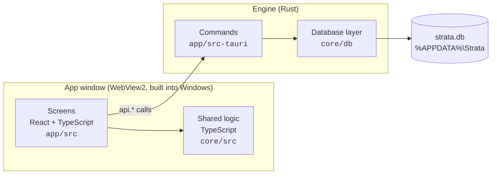

# StrataField

StrataField is a Windows desktop app for recording borewells: who drilled them and where, the soil
layers found at each depth, the pipes put in, water levels over time, and photos and files from the
site. It shows the borewells on a map of the city with how deep the water is, and draws simple
cross-sections of the layers underground between borewells.

It is built for people in the field, not for developers: plain language, step-by-step screens, and
everything works offline (download the Lucknow map once in Settings) except address lookup. Data stays on the computer.

**Current version: 1.0.3** (Tauri). Pilot city: Lucknow.

> **Just want to install it?** See [INSTALL.md](INSTALL.md).

---

## Contents

- [How the app is built](#how-the-app-is-built)
- [Where things are in the code](#where-things-are-in-the-code)
- [How data is stored](#how-data-is-stored)
- [Rules the code follows](#rules-the-code-follows)
- [Developing](#developing)
- [Tests, CI and releases](#tests-ci-and-releases)
- [History: from Electron to Tauri](#history-from-electron-to-tauri)
- [What comes next](#what-comes-next)

---

## How the app is built

StrataField is a [Tauri 2](https://tauri.app) app. A Tauri app has two halves that talk to each
other:



| Half | Language | What it does |
|---|---|---|
| **Screens** (`app/src`) | React, TypeScript, Tailwind, shadcn/ui | Everything you see and click. |
| **Shared logic** (`core/src`) | TypeScript | Checking entries, the soil-type list, reading Excel logs, water-depth colours, cross-section maths, Excel export. No UI code, fully tested. |
| **Commands** (`app/src-tauri`) | Rust | The small set of actions the screens can ask for: save a borewell, add a photo, make a backup… |
| **Database layer** (`core/db`) | Rust | SQLite schema and upgrades, reading and writing records, backups, importing the older app's data. |

**Why this split?** The Rust part is kept small and only does what needs the computer itself (the
database, files, backups). Most logic lives in TypeScript in `core/`, where it is easy to change and
test. Because Tauri uses the WebView2 that Windows already has, instead of shipping its own browser
like Electron, the installer is about 3.5 MB instead of 134 MB.

### What happens when you save a borewell

1. The **New borewell** screen (`app/src/pages/BorewellForm.tsx`) checks the entries with
   `checkBorewell` / `checkLayers` from `core/src/validation.ts` and shows problems in plain words.
2. It calls `api.borewells.create(...)` in `app/src/lib/api.ts`.
3. That invokes the Rust command `borewell_create` in `app/src-tauri/src/commands.rs`.
4. The command calls `borewells::create` in `core/db/src/repo/borewells.rs` inside a database
   transaction, which also writes a line to the record's history.
5. The screen reloads its data (`useLoad` in `app/src/lib/data.tsx`). Any other Strata app open on
   the same data notices the change within a few seconds and reloads too.

### Browser preview

`npm run dev -w app` opens the screens in a normal browser with sample Lucknow data (no Rust needed).
It is used for design reviews and screenshots. The switch is `isPreview` in `app/src/lib/api.ts`;
sample answers are in `app/src/lib/preview.ts` and `sample.ts`. Actions that need the real app
(saving files, backups) say so instead of running.

---

## Where things are in the code

```text
StrataField/
├── app/                        The StrataField desktop app
│   ├── src/                    Screens (React)
│   │   ├── pages/              One file per screen (Home, Borewells, BorewellDetail, BorewellForm,
│   │   │                       EditLayers, MapPage, SectionPage, ImportPage, ExportPage,
│   │   │                       RecycleBin, Settings)
│   │   ├── components/
│   │   │   ├── app/            App frame: menu, page layout, status chips, confirm dialog…
│   │   │   ├── geology/        Borewell drawing, layer patterns, layer popup, layer editor,
│   │   │   │                   cross-section drawing
│   │   │   ├── map/            Base map, borewell pins, water-depth colours, map picker
│   │   │   └── ui/             shadcn/ui building blocks (buttons, dialogs, selects…)
│   │   ├── lib/                api.ts (talks to Rust), data loading, PDF/picture export,
│   │   │                       theme, browser-preview sample data
│   │   └── text/index.ts       All wording shown to users, in one place
│   └── src-tauri/              The Rust side of the app
│       ├── src/commands.rs     Every command the screens can call
│       ├── src/state.rs        Start-up: open the database, import old data, daily backup
│       ├── src/geocode.rs      Address → approximate location (OpenStreetMap, cached)
│       ├── src/photo.rs        Date and GPS position read from photos
│       ├── capabilities/       What the window is allowed to do (files, dialogs)
│       └── tauri.conf.json     Window, security policy, installer settings
├── core/                       Shared by every Strata app (StrataField now, StrataVision later)
│   ├── materials.json          The built-in soil types (read by both TypeScript and Rust)
│   ├── src/                    TypeScript logic + tests (*.test.ts)
│   │   ├── types.ts            Data types: Borewell, StrataLayer, PipeSegment, WaterReading…
│   │   ├── validation.ts       Checks entries; "problems" block saving, "warnings" don't
│   │   ├── section.ts          Cross-section: placing borewells along a line, matching layers
│   │   ├── waterMap.ts         Water-depth estimate and colours for the map
│   │   ├── parser/             Reading Excel drilling logs
│   │   └── export/             Writing Excel workbooks
│   └── db/                     Rust database layer (crate `strata_db`)
│       ├── src/schema.rs       Tables and numbered upgrades (migrations)
│       ├── src/repo/           Reading and writing each kind of record
│       ├── src/backup.rs       Make, list, check and restore backups
│       ├── src/legacy.rs       One-time import from the older Electron StrataField
│       └── tests/              Database, backup and old-data import tests
├── .github/                    CI checks, installer test, release workflow
├── INSTALL.md                  Install guide for users
└── Cargo.toml, package.json    Rust and npm workspaces
```

**Good places to start reading:** `app/src/App.tsx` (list of screens), `app/src/lib/api.ts` (every
action), `core/src/types.ts` (the data), `core/db/src/schema.rs` (the tables).

---

## How data is stored

Everything is in one folder, `%APPDATA%\Strata` (Settings & backup shows it and can open it):

| Path | What it is |
|---|---|
| `strata.db` | The SQLite database: borewells, layers, pipes, water readings, soil types, history, saved cross-sections, settings. |
| `attachments/` | Copies of photos and files added to borewells, and the original Excel files of imports. |
| `backups/` | Backups. One is made automatically each day (the last 10 are kept), plus any you make, plus safety copies before restoring or upgrading. |
| `maps/` | The Lucknow map for use without internet, if downloaded in Settings (built monthly from OpenStreetMap data by `.github/workflows/map-data.yml`). |
| `removed-files/` | Photos and files you removed, kept until no backup could need them, so restoring a backup brings them back. |

- **One database for all Strata apps.** StrataVision will open the same `strata.db`; anything added
  in one app shows up in the other.
- **Upgrades are safe.** The schema has a version number. On start, older databases are backed up and
  then upgraded step by step (`core/db/src/schema.rs`). A database from a *newer* app version is
  refused and left untouched.
- **Nothing is lost by accident.** Deleted borewells go to the Recycle bin first; every change is
  written to the record's history; backups can be restored from Settings.
- **The older Electron app's data** (`%APPDATA%\StrataField\stratafield.db`) is imported
  automatically the first time StrataField 1.0 starts. The old file is only read, never changed.

For development and tests, two environment variables point the app somewhere else so real data is
never touched: `STRATA_DATA_DIR` (instead of `%APPDATA%\Strata`) and `STRATA_LEGACY_ROOT` (where to
look for the older app's data).

---

## Security

How the app protects data and the computer is described in [SECURITY.md](SECURITY.md): which
internet connections it makes, which files it may read and write, signed updates, and how to report
a problem privately.

## Rules the code follows

These come from the project plan and apply to anyone (or any AI assistant) changing the code:

- **Plain language.** Users are not technical. All wording goes in `app/src/text/index.ts`.
- **Never make estimates look measured.** Layers between borewells are drawn faded and dashed, and
  clicking one shows which borewells it came from.
- **Geology follows position, not IDs.** A cross-section orders borewells by where they sit along the
  line drawn on the map, never by ID or database order.
- **Unknown is valid data.** Gaps in layers are warned about and can be marked "Not recorded"; they
  are never filled in silently.
- **Location source is recorded** for every borewell (GPS, photo, map, typed, address, imported).
- **Schema changes only through migrations**, and never remove backups, history or the Recycle bin
  to simplify something.
- **Logic lives in `core/` with tests**; the Rust layer stays thin.
- **Done means it works in the installed app**, not only in development.

---

## Developing

**You need:** Windows 10/11, [Node.js 22](https://nodejs.org), [Rust](https://rustup.rs) (stable,
MSVC) and the Visual Studio C++ Build Tools. WebView2 is already part of Windows.

```bash
git clone https://github.com/Mehulsri07/StrataField.git
cd StrataField
npm install
```

| Command | What it does |
|---|---|
| `npm run dev` | Runs the real app with live reload. |
| `npm run dev -w app` | Screens only, in the browser, with sample data. |
| `npm run build` | Builds the installer into `target/release/bundle/nsis/`. |
| `npm run typecheck` / `npm run lint` / `npm test` | TypeScript checks and the `core` tests. |
| `cargo fmt --all --check`, `cargo clippy --workspace --all-targets -- -D warnings`, `cargo test --workspace` | Rust formatting, lint and tests (run from the repository root). |

**To try the app without touching your own data**, set a scratch folder first (PowerShell):

```powershell
$env:STRATA_DATA_DIR = "$env:TEMP\strata-dev"; npm run dev
```

---

## Tests, CI and releases

- **`core` tests** (Vitest): validation, numbers, layer info, water map, cross-section maths, Excel
  parser.
- **Known vulnerabilities**: CI runs `npm audit` and `cargo audit` on every change; Dependabot
  proposes library updates weekly.
- **Rust tests** (`core/db/tests`): creating and upgrading the database, every kind of record,
  Recycle bin and history, backups and restore (including bringing back removed photos), and
  importing a real database from the older app.
- **End-to-end test** (`e2e/`, `npm run e2e`): starts the real app on a scratch data folder with
  made-up data (an older-app database, an Excel log, a photo with GPS) and works through every
  screen like a user. It checks everything in the V1 definition of done, from bringing over old data
  to backups and restore. It opens an app window, so run it locally only when the computer is free. Build for it first with
  `VITE_E2E=1` (which switches on its stand-ins for file dialogs; normal builds never have them):
  `$env:VITE_E2E = "1"; npm run tauri -w app -- build --debug --no-bundle`.
  In CI it also saves files through the real Windows Save dialog (`E2E_REAL_DIALOGS=1`).
- **CI** (`.github/workflows/ci.yml`). Every pull request gets the fast checks, which take about
  2-3 minutes: typecheck, lint, tests and a frontend build on Linux, plus Rust format, lint and
  tests on Windows, and the end-to-end test on Windows. The slow part builds the optimised installer and runs a **clean-machine test**
  (`.github/scripts/installer-test.ps1`). That test installs the app on a fresh Windows runner,
  starts it twice, installs over the top and uninstalls, checking the data survives. The slow part
  runs after merging to `main`, and on pull requests that touch packaging or start-up code.
  Documentation-only changes skip CI. Sizes, start-up time and memory appear in the run summary.
- **Releases** (`.github/workflows/release.yml`). Pushing a tag like `v1.0.1` checks it matches
  the version in `app/src-tauri/tauri.conf.json`, then builds and tests the installer. It attaches
  three files to a **draft** GitHub release, to be published by hand: the installer, its update
  signature (`.sig`) and `latest.json`.

To release a new version: set the same version in `app/package.json`, `app/src-tauri/Cargo.toml`
and `app/src-tauri/tauri.conf.json`, add a section for it at the top of [CHANGELOG.md](CHANGELOG.md)
(it becomes the "What's new" part of the release notes; the release stops if it is missing), merge, then tag the merge commit (`git tag -a v1.0.1 -m ...`
and `git push origin v1.0.1`). Check the draft release and publish it.

### Automatic updates

Installed copies check for a newer version once a day, using the `latest.json` of the newest
**published** release. When there is one, they show "StrataField x.y.z is available". Choosing
**Install and restart** downloads it, closes the app, updates it and opens it again. Settings →
About also has **Check for updates**.

Updates are **signed**, and an installed copy only accepts an update signed with the project's key.
The public half of the key is in `tauri.conf.json` (`plugins.updater.pubkey`). The private half and
its password are kept outside the repository:

- as the repository secrets `TAURI_SIGNING_PRIVATE_KEY` and `TAURI_SIGNING_PRIVATE_KEY_PASSWORD`,
  which the Release workflow uses;
- on the maintainer's computer in `%USERPROFILE%\.tauri\stratafield-updater.key` and
  `stratafield-updater.password`. **Keep a safe copy.** If the key is lost, installed copies can
  never be updated again, and users would have to install a new version by hand.

Only the Release workflow signs builds (`--config src-tauri/tauri.release.conf.json`). Everyday and
CI builds don't need the key.

---

## History: from Electron to Tauri

StrataField 0.x was an **Electron** app. It worked, but was large (a 134 MB installer), its map was
broken and its screens had layout bugs. Version 1.0 is a full rebuild on **Tauri**, with new screens,
a native SQLite database instead of sql.js, and the same data carried over automatically.

**The Electron app is no longer used or built.** `main` contains only the Tauri app. The last
Electron version is kept for reference on the
[`archive/electron`](https://github.com/Mehulsri07/StrataField/tree/archive/electron) branch. The
only Electron-related code left in `main` is the one-time import of the old app's database
(`core/db/src/legacy.rs`).

---

## What comes next

- **StrataVision**, the analysis side: curved sections, elevation, confidence per depth, section PDFs.
  It will start as screens inside StrataField and share `core/` and the same database, and only
  become a separate app if 3D or heavy map work needs it.
- Freezing and versioning the shared data format (possibly with GeoPackage exports that open in
  QGIS).
- Later, only if there is a clear need: sync between computers, several users, mobile.

## Data sources

- **Maps:** © OpenStreetMap contributors (ODbL). The downloadable Lucknow map is built with
  Protomaps (`.github/workflows/map-data.yml`).
- **Ground heights** (`app/src/assets/lucknow-elevation.bin`, built by `scripts/build-elevation.mjs`):
  Terrain Tiles on AWS (https://registry.opendata.aws/terrain-tiles/), which around Lucknow come from
  SRTM (NASA). Approximate: a few metres, partly including buildings in built-up areas.

## License

MIT
